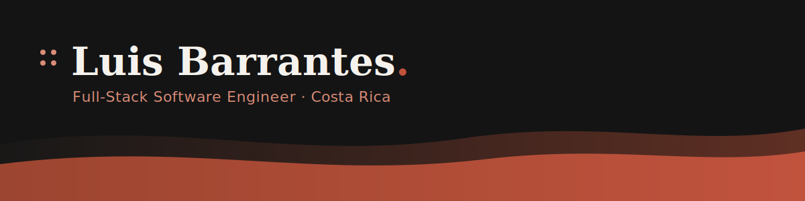

I'm a full-stack developer with a track record thriving in startups and other fast-paced environments, where priorities shift quickly and ownership matters. I'm proactive by nature, I look for problems before they become blockers, take initiative without waiting to be asked, and follow through on what I commit to. I put as much care into communication as I do into code: keeping my team and stakeholders in the loop, asking the right questions early, and making sure technical decisions are understood by everyone involved. Always eager to collaborate, adapt to new technologies, and keep growing both my technical and soft skills.

### 🔭 Currently focused on

Exploring how AI agents and LLM tooling reshape day-to-day engineering, building with them, not just talking about them.

### 💼 Experience

| Company | Role | Years |
|---|---|---|
| Thoropass | Software Engineer | 2021 – 2026 |
| SweetRush Inc. | Tech Lead / Software Engineer | 2017 – 2021 |
| Hangar Worldwide (Critical Mass LATAM) | Front-end Developer | 2014 – 2017 |
| Hewlett-Packard | Reporting Analyst / Developer | 2013 – 2014 |

🎓 Universidad de Costa Rica — Informática Empresarial (2008 – 2013)

### 🚀 Projects

- 🖥️ **[lbarrantes-resume](https://github.com/KikeCR/lbarrantes-resume)**    — my personal site/resume: React, TypeScript, Tailwind & MUI, bilingual (EN/ES), with a downloadable PDF resume, an animated tech stack section, and Playwright end-to-end tests.
- 🔐 **[password-generator](https://github.com/KikeCR/password-generator)**    — a small React app for generating strong, secure passwords.
- 🎮 **[savestate-kb](https://github.com/KikeCR/savestate-kb)**      — a multi-user game completion tracker (Backloggery/Grouvee-style): React, Flask, SQLAlchemy & Redis, with a drag-and-drop Kanban board, leaderboards, a follow-based activity feed, AI-powered game recommendations (a RAG pipeline: local embeddings + pgvector retrieval + DeepSeek/Kimi ranking), and full test coverage (Vitest + pytest).

### 🧰 Tech Stack

**Front-end**

**Back-end**

### Beyond the code

Music & concerts, traveling, photography, the outdoors, dogs, working out, and spending time with my loved ones.

### 📫 Let's connect

[🌐 Portfolio](https://lbarrantes.com) · [💼 LinkedIn](https://www.linkedin.com/in/luis-enrique-barrantes-8141995b/) · [✉️ Email](mailto:luis.barrantesv@gmail.com)
